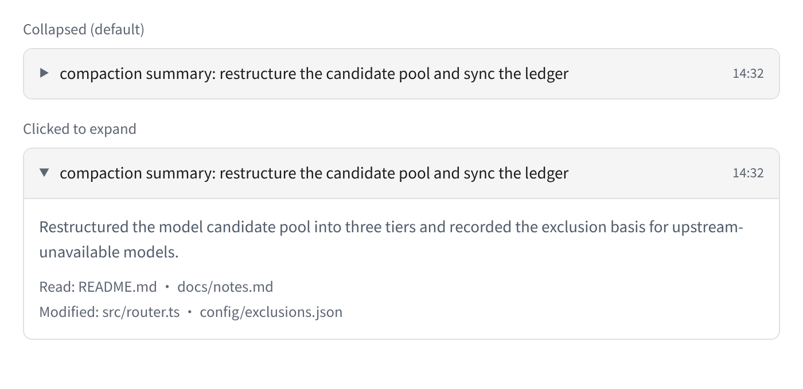
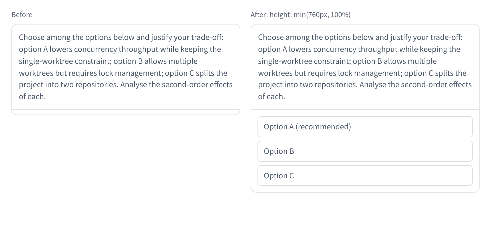
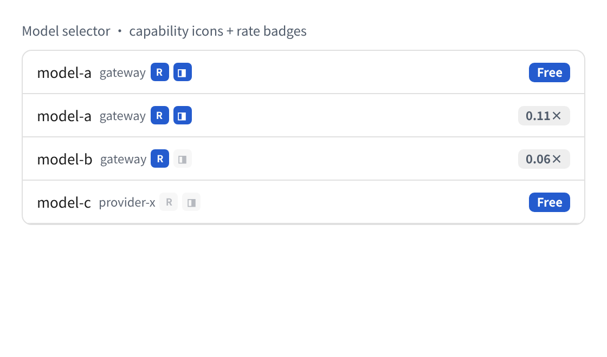
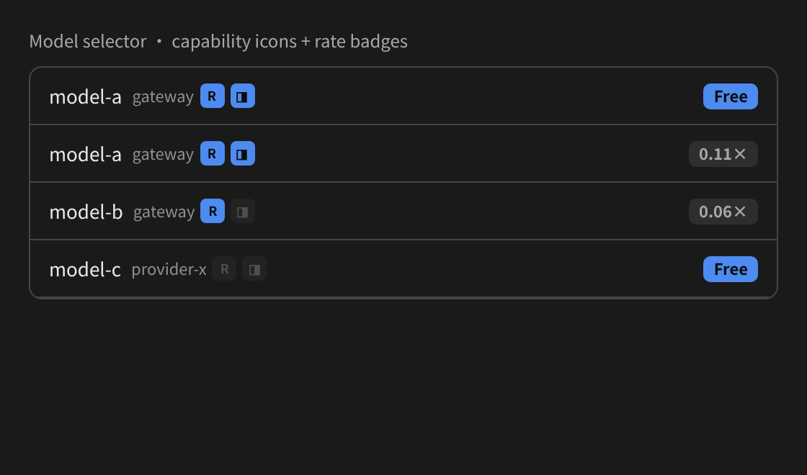
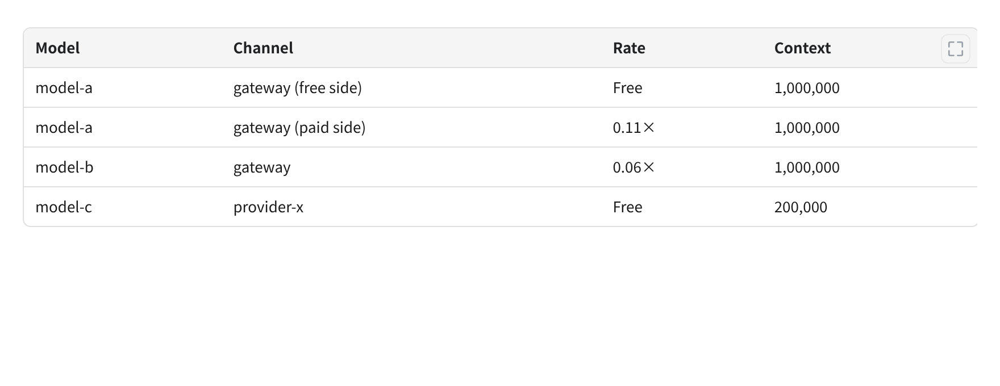
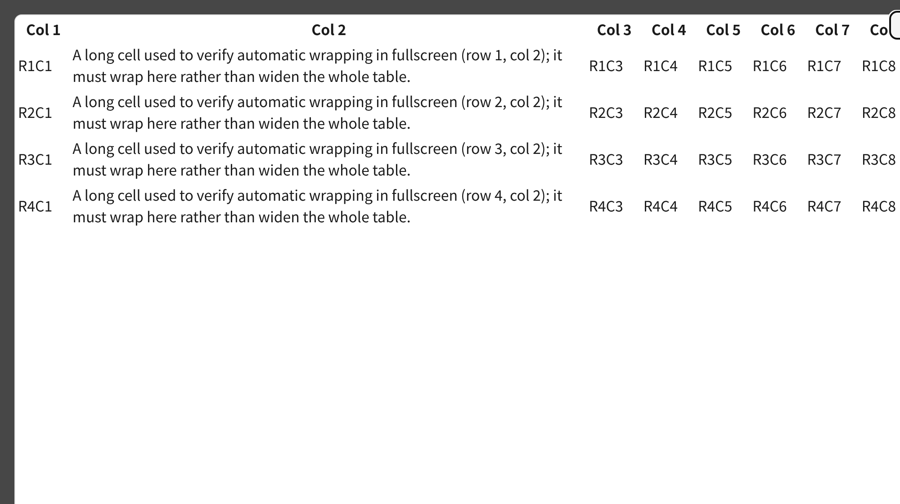

# pi-web-patches — an enhancement patch series for pi-web

> Upstream baseline: [@agegr/pi-web](https://github.com/agegr/pi-web) **v0.10.0** (MIT).
> This project is **not** a Pi extension. It is a **patch series** against pi-web
> (ordered `git format-patch` numbering), applied as working-tree state so the
> upstream commit history is never rewritten.

*[中文版 / Chinese version](README.zh-CN.md)*

## 1. What's inside

| # | Patch | Type | Effect |
|---|---|---|---|
| 0001 | `feat-pi-web-compaction` | feat | Collapse compaction messages by default. The title bar becomes a clickable button (`aria-expanded`) showing only a chevron, the summary's first line and the timestamp; expanding reveals the full summary plus the read/modified file list |
| 0002 | `chore-pi-web-pnpm` | chore | Ignore pnpm-generated lockfile (the project keeps the upstream npm layout) |
| 0003 | `fix-pi-web-height-maxHeight` | fix | Long questions no longer squeeze the options area: the dialog gets an explicit height so it resolves to a definite size |
| 0004 | `feat-pi-web-model-caps-rate-badges` | feat | Model capability icons, rate badges and a **disabled-model marker**: `/api/models` reads a `model-caps.json` sidecar and renders reasoning/image capability icons, a rate badge, and — for models an operator has taken out of rotation — a strikethrough plus a no-entry icon (unselectable) |
| 0005 | `feat-pi-web-table-zoom` | feat | Markdown table **zoom button and fullscreen view**. The button floats at the table's top-right (always visible on touch); in fullscreen, `<dialog>` cells **wrap automatically**, falling back to horizontal scrolling only when a table has too many columns to fit |
| 0006 | `feat-pi-web-model-cooldown-badge` | feat | **Cooldown marker, deliberately without a strikethrough**: `/api/models` reads the router's live `error-state.json` and marks models that are temporarily cooling down (upstream rate/usage limits, upstream unavailable). A cooling-down model gets an **amber no-entry icon and no strikethrough**, while an operator-disabled model keeps the red icon **and** the strikethrough — so "wait a moment" and "someone must act" stay visually distinct |
| 0007 | `feat-pi-web-model-picker-refresh-on-open` | feat | **Opening the model picker refreshes the list**: the cooldown state lives in another process, so the picker used to show a session-start snapshot. Opening the picker now bumps the existing model-refresh key (the same path the catalog refresh uses), so a cooldown that started mid-session shows up right when you pick a model |

> **Not every patch is screenshot-able.** 0002 only changes `.gitignore`, and 0007 is
> behavioural (nothing new is on screen until you open the picker), so neither has a
> screenshot. 0006 renders inside the same picker as 0004, so the 0004 screenshots show
> the surface it appears on; a dedicated cooldown screenshot is not included yet.

## 2. Effect screenshots

> **Note on method**: these are not mockups. Each image was rendered headlessly with the
> **real CSS rules and real component DOM structure from the patched source** (the
> `.markdown-table-wrap`, `.table-zoom-*` and dialog rules are extracted verbatim from the
> patched `app/globals.css`; the zoom-button SVG is the patch's own four-segment path).
> They show what the patched UI produces, not an artist's impression of it.
>
> **Bilingual**: the screenshots are shipped in both languages — `docs/screenshots/en/`
> (used by this README) and `docs/screenshots/zh-CN/` (used by `README.zh-CN.md`).
> Same rendering, same data, only the annotation text differs.

### 0001 — compaction messages collapse by default

Collapsed state shows only a chevron, the summary's first line and the timestamp; clicking
(`aria-expanded`) reveals the full summary plus the read/modified file list.



### 0003 — long questions no longer squeeze the options area

Left: before (`maxHeight` alone does not give the dialog a definite height, so the long
question compresses the options — options B and C are cut off). Right: after
(`height: min(760px, 100%)`, all options visible).



### 0004 — model capability icons and rate badges

Capability icons show on/off state (bright = supported, dimmed = not), and the rate badge
distinguishes free from paid multipliers. Rendered in both themes because the badges use
theme variables.

A **disabled** model (one taken out of rotation by an operator but still in the pool) is drawn
with a strikethrough **and** a no-entry icon, and cannot be selected. Both signals are kept
deliberately: a strikethrough is a *typographic* signal, so it reads poorly in a long list and can
be lost to an ellipsis or an unusual font, while the icon is an independent shape that survives
all of that. If one channel fails, the other still identifies the row.





### 0005 — table zoom button and fullscreen view

**a)** The zoom button floats at the table's top-right (desktop reveals it on hover; touch
devices keep it resident, since there is no hover):



**b)** Fullscreen view: a long cell **wraps onto a second line** instead of forcing the
whole table to one-line width, so the row stays readable without horizontal scrolling.



## 3. Why patches instead of pull requests

This series follows a **never-upstream** policy: the patches are for local use and are
**never submitted upstream as PRs**. Upgrading the upstream version is therefore not a
rebase but a **patch re-issue**:

1. Point the upstream checkout at the new tag;
2. Apply this series in order; any failure means a conflict with the new upstream;
3. Realign the patches against the new upstream, keeping the same ordered numbering.

The payoff: the upstream repository stays a **read-only tag**, local changes create no
orphan commits, and clones are reproducible.

## 4. Applying

```bash
# Fetch the upstream baseline
git clone --depth 1 -b v0.10.0 https://github.com/agegr/pi-web
cd pi-web

# Apply in order (the numbering is the order)
for p in /path/to/pi-web-patches/patches/*.patch; do
  git apply --check "$p" && git apply "$p" || { echo "conflict: $p"; break; }
done
```

> Use `git apply`, not `git am`: mailinfo is skipped, which preserves whitespace
> semantics such as CRLF exactly.

Build the upstream project normally afterwards (pi-web is a Next.js app; install
dependencies before building).

## 5. Patches are bound to an upstream version

The patches apply by **line-context**, so they are tightly bound to the upstream
version. `git apply --check` failing against a different baseline is **expected
behaviour, not a defect** — re-issue the patches rather than forcing `--3way`.

## 6. Optional data dependency of 0004 and 0006

The rate badges and capability icons rendered by 0004 come from two sources:

- **Capabilities** (`reasoning`, image input): declared per model and served to the
  web UI through `/api/models`;
- **Rate**: a `model-caps.json` **sidecar** file (schema 1) in the agent directory.

A sidecar is used instead of a `cost` field because the rate is a **relative multiplier
of the upstream billing factor**, not a currency price; writing it into `cost` would
corrupt that field's semantics. When the sidecar is missing, 0004 **degrades silently** —
no badges are shown and nothing else breaks.

- **Disabled flag**: the same sidecar may carry `disabled: true` per model. This is produced
  outside this patch series (by whatever job maintains your model list — the patches only
  *read* it), and it is what drives the strikethrough and the no-entry icon. Absent or
  false ⇒ the model renders normally, so the feature is inert until you populate it. A
  model missing from the sidecar entirely is simply not marked.

Note that the flag must be threaded through **every** hop between `/api/models` and the
selector row — the route maps caps onto the model list, and each consumer maps that list onto
`ModelSelectorOption`. A single hop that drops the field makes the feature silently invisible
while both ends still look correct; that is exactly the failure mode to guard against when
you extend this.

- **Cooldown state (0006)**: unlike the two sources above, cooldown is read **live** from
  the router's `error-state.json` in the agent state directory (`<state dir>/model-router/`,
  overridable by the router's own state-dir environment variable). An entry is
  `{"<channel>/<model>": {"until": <epoch ms>, "reason": "..."}}`; only entries whose `until`
  is still in the future are surfaced, and expired entries are dropped **on the server side**
  as well as in the browser, so a cooling-down model never stays blocked past its deadline.
  With no such file (or no router at all) nothing is marked and the picker behaves exactly as
  before — the feature is inert. Cooldown is **auto-expiring**; the `disabled` flag is
  **operator-managed**. That is why they render differently (amber icon vs. red icon +
  strikethrough) and why 0006 deliberately does **not** add a strikethrough.

## 7. Changelog

| Version | Change |
|---|---|
| 1.3.0 | Two new patches: **0006** cooldown marker in the model picker (amber no-entry icon, no strikethrough) fed by the router's live `error-state.json`, and **0007** refresh-on-open for the model picker. Series is now 7 patches (0001–0007); verified to replay byte-identically onto pi-web v0.10.0 |
| 1.2.0 | No functional change: comment wording only (the applied tree is identical to 1.1.0 apart from comments) |
| 1.1.0 | 0004 extended: `disabled` flag from the `model-caps.json` sidecar renders a strikethrough **and** a no-entry icon, and such models cannot be selected |
| 1.0.0 | First public release: 5 patches (0001–0005) against pi-web v0.10.0 |

## 8. License

The upstream code these patches modify is MIT (see the upstream `LICENSE`). This patch
series is likewise offered under **MIT**.
