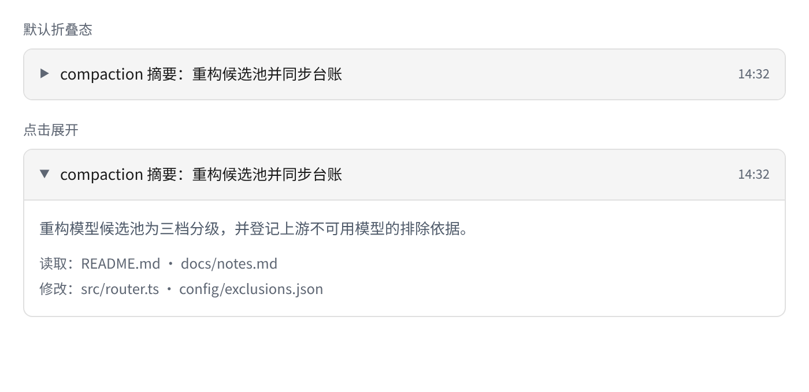
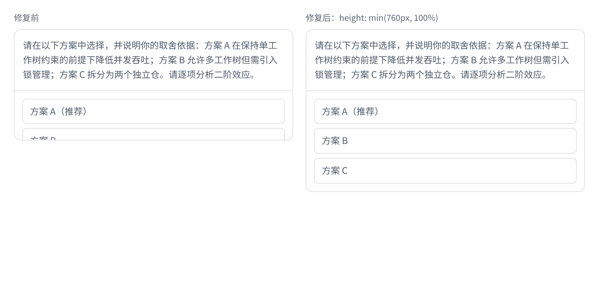
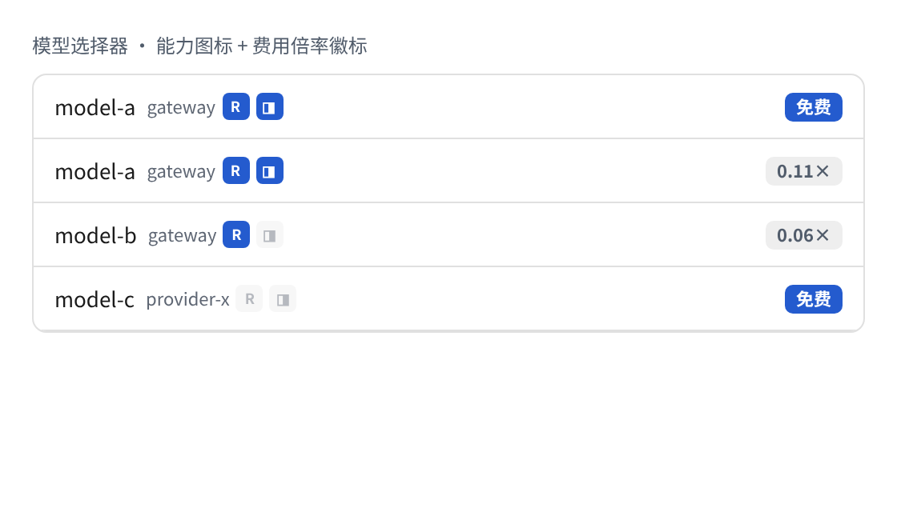
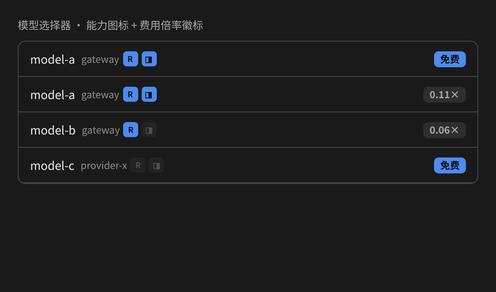
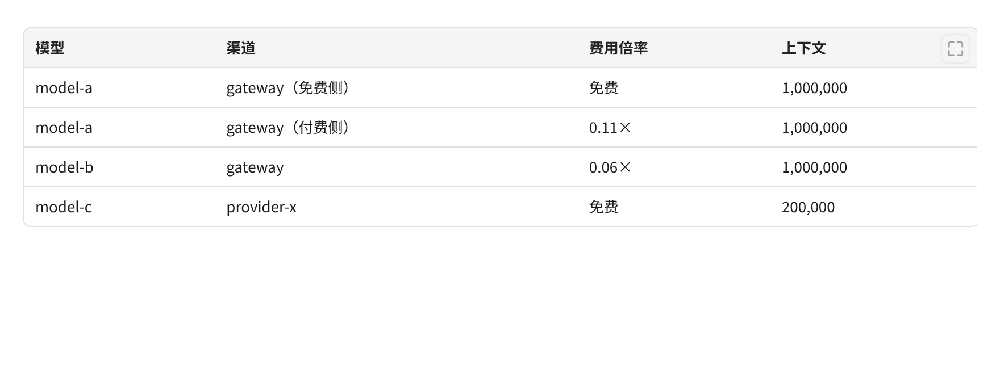
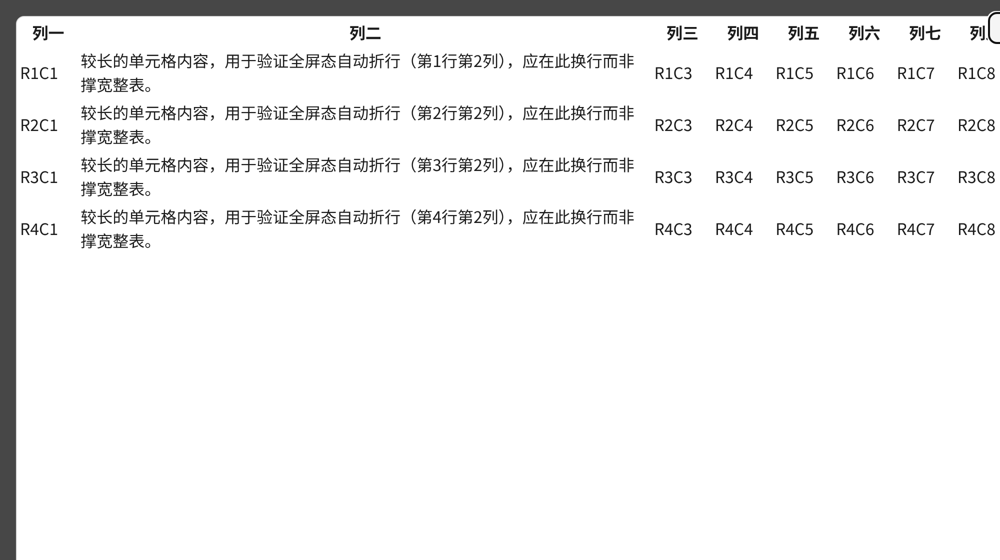

# pi-web-patches —— pi-web 增强补丁集

> 上游基线：[@agegr/pi-web](https://github.com/agegr/pi-web) **v0.10.0**（MIT）。
> 本项目**不是** Pi 扩展，而是针对 pi-web 的**补丁系列**（`git format-patch` 有序编号），
> 以工作树态应用，不改写上游提交历史。

*[English version / 英文版](README.md)*

## 一、包内有什么

| # | 补丁 | 类型 | 作用 |
|---|---|---|---|
| 0001 | `feat-pi-web-compaction` | feat | compaction 消息默认折叠：标题栏成为可点击按钮（`aria-expanded`），仅显示箭头、摘要首行与时间；展开后见完整摘要与读/改文件清单 |
| 0002 | `chore-pi-web-pnpm` | chore | 忽略 pnpm 安装产生的锁文件（项目与上游 npm 布局保持一致） |
| 0003 | `fix-pi-web-height-maxHeight` | fix | 长提问不再挤扁选项区：对话框补 `height` 构成确定高度 |
| 0004 | `feat-pi-web-model-caps-rate-badges` | feat | 模型能力图标、费用倍率徽标与**禁用标记**：`/api/models` 读取 `model-caps.json` 侧车文件，在模型选择器上渲染 `reasoning`/图像能力图标与倍率徽标；对被维护者移出轮换的模型，渲染删除线 + 禁止进入图标且不可点选 |
| 0005 | `feat-pi-web-table-zoom` | feat | markdown 表格**放大按钮与全屏查看**：按钮浮于表格右上角（触屏常驻）；全屏态 `<dialog>` **单元格自动折行**，列极多等无法折尽的情况才退化为横向滚动 |

> **并非每个补丁都可截图。** 0002 只改 `.gitignore`，无视觉面，故不出图；其余四个见下。

## 二、效果截图

> **方法说明**：以下不是示意图。每张图均由无头浏览器渲染，**用的是补丁后源码里的真实 CSS 规则与真实组件 DOM 结构**
> （`.markdown-table-wrap`、`.table-zoom-*`、dialog 规则均逐字取自补丁后的 `app/globals.css`，
> 放大按钮 SVG 即补丁自带的四段对角箭头 path）。它们展示的是补丁界面**实际产出**，不是手绘印象。
>
> **双语**：截图分语言交付——`docs/screenshots/zh-CN/`（本 README 引用）与
> `docs/screenshots/en/`（`README.md` 引用）。渲染与数据完全一致，仅标注文字不同。

### 0001 —— compaction 消息默认折叠

折叠态只显示箭头、摘要首行与时间；点击（`aria-expanded`）后展开完整摘要与读/改文件清单。



### 0003 —— 长提问不再挤扁选项区

左：修复前（仅 `maxHeight` 不构成确定高度，长提问压缩选项区，方案 B/C 被截断）；
右：修复后（`height: min(760px, 100%)`，三个方案均完整可见）。



### 0004 —— 模型能力图标与费用倍率徽标

能力图标区分支持与否（亮 = 支持，暗 = 不支持），倍率徽标区分免费与付费；同时给出亮/暗两套主题，
因为徽标取的是主题变量。

**被禁用**的模型（被维护者移出轮换、但仍在池中）会**同时**渲染删除线与禁止进入图标，且不可点选。
两路信号是刻意并存的：删除线是**排版**信号，在长列表里辨识度低，且可能被省略号或特殊字体吞掉；
图标是独立形状，不受这些影响。任一路失效，另一路仍能标识该行。





### 0005 —— 表格放大按钮与全屏查看

**a）** 放大按钮浮于表格右上角（桌面态 hover 显形；触屏无 hover，故常驻可见）：



**b）** 全屏态：较长单元格**自动折到第二行**，而不是把整张表撑成一行宽，无需横向滚动即可阅读。



## 三、为什么是补丁而不是 PR

本补丁集的决策是 **never-upstream** —— 补丁仅自用，**永不以 PR 形式回上游**。
因此上游升级时不是 rebase，而是「重出补丁」：

1. 把上游基线换成新 tag；
2. 依次应用本系列；失败即说明与新上游冲突；
3. 对齐新上游重出补丁，沿用同一有序编号。

收益：上游仓库恒为**只读 tag**，本地改动没有提交孤岛，克隆可复现。

## 四、应用

```bash
# 取上游基线
git clone --depth 1 -b v0.10.0 https://github.com/agegr/pi-web
cd pi-web

# 依次应用（顺序即编号顺序）
for p in /path/to/pi-web-patches/patches/*.patch; do
  git apply --check "$p" && git apply "$p" || { echo "冲突：$p"; break; }
done
```

> 用 `git apply` 而非 `git am`：不经 mailinfo，保真 CRLF 等空白语义。

应用后正常构建上游项目即可（pi-web 为 Next.js 应用，构建前需先安装依赖）。

## 五、补丁与上游版本绑定

补丁**按行号上下文**应用，与上游版本强绑定。基线不匹配时 `git apply --check` 会失败 ——
这是**预期行为，不是缺陷**；此时应重出补丁，而非强行 `--3way`。

## 六、0004 的数据依赖（可选）

0004 渲染的费用倍率与能力图标来自两个数据源：

- **能力**（`reasoning`、图像输入）：随模型声明，经 `/api/models` 下发给前端；
- **费用倍率**：agent 目录下的 `model-caps.json` **侧车文件**（schema 1）。

之所以用侧车而非写进 `cost` 字段：该倍率是**上游计费倍数的相对系数**，不是货币价格，
写进 `cost` 会造成语义污染。**侧车缺失时 0004 静默降级** —— 不显示徽标，其余功能不受影响。

- **禁用标记**：同一侧车可为每个模型携带 `disabled: true`。该字段**不由本补丁系列生成**
  （由维护你模型清单的那个任务写入，补丁只**读**它），它驱动删除线与禁止进入图标。
  字段缺失或为 `false` ⇒ 正常渲染，即在你填充之前该特性不生效；侧车里没有的模型自然也不会被标记。

注意该标记必须**逐跳透传**：从 `/api/models` 到选择器行之间，路由会把 caps 映射到模型列表，
而每个消费方又会把列表映射为 `ModelSelectorOption`。只要有一跳丢字段，功能就会**静默不可见**，
而两端看起来都还是对的 —— 当你扩展此处时，这正是要防的失效模式。

## 七、变更记录

| 版本 | 变更 |
|---|---|
| 1.1.0 | 0004 扩展：`model-caps.json` 侧车的 `disabled` 标记渲染删除线**与**禁止进入图标，且此类模型不可点选 |
| 1.0.0 | 首次公开发布：pi-web v0.10.0 基线的 5 个补丁（0001–0005） |

## 八、许可

本系列所修改的上游代码为 MIT（见上游 `LICENSE`）。本补丁系列同样以 **MIT** 提供。
